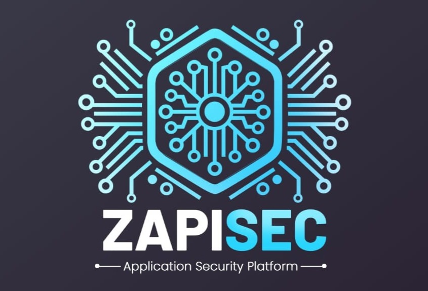

# ZAPISEC WAF CoPilot



[](https://opensource.org/licenses/MIT)
[](https://www.python.org/downloads/)
[](https://nodejs.org/)
[](https://www.djangoproject.com/)
[](https://nextjs.org/)
[](https://www.typescriptlang.org/)
[](https://openai.com/)

## About

ZAPISEC WAF CoPilot is an automated AI-powered security framework for web applications with a focus on highly configurable streamlined vulnerability assessment process via AI engines, CVE data correlation and organization, continuous monitoring, backed by a database, and simple yet intuitive User Interface. ZAPISEC WAF CoPilot makes it easy for security professionals to generate WAF rules and testing code with intelligent automation.

### Core Mission
Our mission is to bridge the gap between vulnerability discovery and actionable security implementation. ZAPISEC WAF CoPilot leverages cutting-edge AI technology to analyze Common Vulnerabilities and Exposures (CVEs), generate platform-specific WAF rules, and provide educational testing code for comprehensive security understanding.

### Key Capabilities
- **Intelligent CVE Analysis**: AI-powered vulnerability assessment with detailed explanations and severity analysis
- **Multi-Platform WAF Integration**: Generate deployable rules for major cloud providers and WAF solutions ([AWS WAF](https://aws.amazon.com/waf/), [Azure Front Door](https://azure.microsoft.com/en-us/services/frontdoor/), [Google Cloud Armor](https://cloud.google.com/armor), [Cloudflare](https://www.cloudflare.com/waf/))
- **Educational Testing Framework**: Create safe, educational testing environments for vulnerability simulation
- **Real-time Security Workflow**: Streamline security operations from detection to deployment
- **Compliance-Ready Documentation**: Generate comprehensive security reports and audit trails

### Target Users
- **Security Engineers**: Rapid vulnerability assessment and rule deployment
- **DevOps Teams**: Integration of security into CI/CD pipelines
- **Security Researchers**: Educational testing and vulnerability analysis
- **Compliance Officers**: Automated reporting and audit documentation


**External Link**: [Zapisec Application Security](https://zapisec.ai)

**Tags**: `waf` `security` `ai` `cve` `vulnerability-assessment` `penetration-testing` `infosec` `pentesting` `web-security` `automation` `cloud-security` `aws` `azure` `gcp` `cloudflare` `testing-code` `security-tools` `zapisec-waf-copilot`

## 🎥 Demo Video

https://github.com/user-attachments/assets/dd8f3e6c-42f3-4db1-a5f8-592c4678b45a

*Watch the demo video above to see ZAPISEC WAF CoPilot in action!*

## Features

| Feature | Description | Benefits |
|---------|-------------|----------|
| **🔒 CVE Management** | Automated CVE detection, status tracking, and AI-powered explanations | Reduce analysis time from hours to minutes |
| **🛡️ WAF Rule Generation** | Multi-platform support with JSON/cURL formats | Deploy rules across any cloud provider |
| **🧪 Testing Code** | Generate educational Python testing code for vulnerability simulation | Safe environment for security training |
| **📊 Dashboard** | Real-time statistics, interactive tables, and bulk operations | Comprehensive security overview |
| **🤖 AI Analysis** | GPT-4 powered vulnerability analysis and rule generation | Expert-level security insights |
| **📈 Visual Flowcharts** | Mermaid.js diagrams showing vulnerability lifecycle | Clear understanding of security workflows |
| **🔄 Status Tracking** | Track progress from Not Started → Started → In Progress → Closed | Organized vulnerability management |
| **📋 Bulk Operations** | Mass status updates and rule generation | Efficient handling of multiple CVEs |

## WAF Compatibility

| WAF Platform | Provider | Rule Format | Status | Features |
|--------------|----------|-------------|--------|----------|
| **AWS WAF** | Amazon Web Services | JSON/cURL | ✅ Supported | Rate limiting, IP blocking, SQL injection protection |
| **Azure Front Door** | Microsoft Azure | JSON/cURL | ✅ Supported | DDoS protection, geo-filtering, custom rules |
| **Google Cloud Armor** | Google Cloud Platform | JSON/cURL | ✅ Supported | Adaptive protection, preconfigured rules |
| **Cloudflare** | Cloudflare | JSON/cURL | ✅ Supported | Web Application Firewall, DDoS mitigation |

## Example Workflows

### Workflow 1: WAF Rule Generation for CVE-2021-44228 (Log4Shell)

**Scenario**: Generate AWS WAF rules to protect against Log4Shell vulnerability

#### Step 1: CVE Analysis
```
CVE ID: CVE-2021-44228
Severity: Critical (9.8/10)
Description: Apache Log4j2 JNDI features do not protect against attacker controlled LDAP and other JNDI related endpoints
```

#### Step 2: AI-Powered Rule Generation
```json
{
  "Name": "Log4Shell-Protection",
  "Description": "Protection against CVE-2021-44228 (Log4Shell)",
  "Rules": [
    {
      "Name": "BlockLog4ShellPayloads",
      "Priority": 1,
      "Action": {
        "Block": {}
      },
      "VisibilityConfig": {
        "SampledRequestsEnabled": true,
        "CloudWatchMetricsEnabled": true,
        "MetricName": "Log4ShellBlockedRequests"
      },
      "Statement": {
        "ByteMatchStatement": {
          "SearchString": "${jndi:",
          "FieldToMatch": {
            "UriPath": {}
          },
          "TextTransformations": [
            {
              "Priority": 1,
              "Type": "LOWERCASE"
            }
          ],
          "PositionalConstraint": "CONTAINS"
        }
      }
    }
  ]
}
```

#### Step 3: Deployment
```bash
# AWS CLI deployment
aws wafv2 create-web-acl \
  --name Log4Shell-Protection \
  --scope REGIONAL \
  --default-action Allow={} \
  --rules file://log4shell-rules.json
```

### Workflow 2: Testing Code Generation for CVE-2021-34527 (PrintNightmare)

**Scenario**: Generate educational Python testing code for PrintNightmare vulnerability

#### Step 1: CVE Details Input
```
CVE ID: CVE-2021-34527
Description: Windows Print Spooler Remote Code Execution Vulnerability
Severity: Critical (9.8/10)
```

#### Step 2: Generated Testing Code
```python
#!/usr/bin/env python3
"""
Educational Testing Code for CVE-2021-34527 (PrintNightmare)
WARNING: This code is for educational purposes only.
Do not use against systems you don't own or have permission to test.
"""

import socket
import struct
import sys
from typing import Optional

class PrintNightmareTest:
    def __init__(self, target_host: str, target_port: int = 445):
        self.target_host = target_host
        self.target_port = target_port
        self.socket = None
    
    def connect_to_target(self) -> bool:
        """Establish connection to target SMB service"""
        try:
            self.socket = socket.socket(socket.AF_INET, socket.SOCK_STREAM)
            self.socket.settimeout(10)
            self.socket.connect((self.target_host, self.target_port))
            print(f"[+] Successfully connected to {self.target_host}:{self.target_port}")
            return True
        except Exception as e:
            print(f"[-] Failed to connect: {e}")
            return False
    
    def test_spooler_service(self) -> bool:
        """Test if Print Spooler service is running"""
        try:
            # SMB Negotiate Protocol Request
            negotiate_request = (
                b"\xff\x53\x4d\x42"  # SMB Header
                b"\x72"              # Negotiate Protocol
                b"\x00\x00\x00\x00"  # Reserved
                b"\x18\x53\xc8"      # Dialects
            )
            
            self.socket.send(negotiate_request)
            response = self.socket.recv(1024)
            
            if response.startswith(b"\xff\x53\x4d\x42"):
                print("[+] SMB service is accessible")
                return True
            else:
                print("[-] SMB service not accessible")
                return False
                
        except Exception as e:
            print(f"[-] Error testing spooler service: {e}")
            return False
    
    def check_vulnerability_indicators(self) -> dict:
        """Check for indicators of PrintNightmare vulnerability"""
        indicators = {
            "spooler_running": False,
            "anonymous_access": False,
            "guest_access": False,
            "risk_level": "UNKNOWN"
        }
        
        try:
            # Test for anonymous access to spooler
            # This is a simplified test - real exploitation is more complex
            indicators["spooler_running"] = self.test_spooler_service()
            
            if indicators["spooler_running"]:
                indicators["risk_level"] = "HIGH"
                print("[!] Print Spooler service is running - potential vulnerability")
            else:
                indicators["risk_level"] = "LOW"
                print("[+] Print Spooler service appears to be disabled")
                
        except Exception as e:
            print(f"[-] Error checking vulnerability indicators: {e}")
        
        return indicators
    
    def generate_remediation_advice(self, indicators: dict) -> str:
        """Generate remediation advice based on findings"""
        advice = []
        
        if indicators["spooler_running"]:
            advice.append("1. Disable Print Spooler service if not required")
            advice.append("2. Apply Microsoft security patches (KB5004945)")
            advice.append("3. Restrict network access to Print Spooler")
            advice.append("4. Enable Windows Defender Exploit Protection")
        
        if not advice:
            advice.append("System appears to be properly configured")
        
        return "\n".join(advice)
    
    def run_test(self) -> dict:
        """Run complete vulnerability test"""
        print(f"[*] Starting PrintNightmare vulnerability test against {self.target_host}")
        print("[*] This is an educational test - do not use maliciously\n")
        
        if not self.connect_to_target():
            return {"error": "Failed to connect to target"}
        
        indicators = self.check_vulnerability_indicators()
        remediation = self.generate_remediation_advice(indicators)
        
        print(f"\n[+] Test Results:")
        print(f"   Risk Level: {indicators['risk_level']}")
        print(f"   Spooler Running: {indicators['spooler_running']}")
        
        print(f"\n[+] Remediation Advice:")
        print(remediation)
        
        return {
            "target": self.target_host,
            "indicators": indicators,
            "remediation": remediation
        }
    
    def cleanup(self):
        """Clean up resources"""
        if self.socket:
            self.socket.close()

def main():
    if len(sys.argv) != 2:
        print("Usage: python3 printnightmare_test.py <target_host>")
        print("Example: python3 printnightmare_test.py 192.168.1.100")
        sys.exit(1)
    
    target = sys.argv[1]
    tester = PrintNightmareTest(target)
    
    try:
        results = tester.run_test()
        print(f"\n[+] Test completed successfully")
    except KeyboardInterrupt:
        print("\n[!] Test interrupted by user")
    except Exception as e:
        print(f"\n[-] Test failed: {e}")
    finally:
        tester.cleanup()

if __name__ == "__main__":
    main()
```

#### Step 3: Usage Instructions
```bash
# Educational testing (replace with your test target)
python3 printnightmare_test.py 192.168.1.100

# Expected output:
# [*] Starting PrintNightmare vulnerability test against 192.168.1.100
# [+] Successfully connected to 192.168.1.100:445
# [+] SMB service is accessible
# [!] Print Spooler service is running - potential vulnerability
# [+] Test Results:
#    Risk Level: HIGH
#    Spooler Running: True
```

## Use Cases

- **🔍 Security Audits**: Quickly identify and assess vulnerabilities in your applications
- **🛡️ WAF Implementation**: Generate platform-specific rules for immediate deployment
- **📚 Security Training**: Use generated testing code to educate teams about vulnerabilities
- **🚀 DevOps Integration**: Streamline security workflows in CI/CD pipelines
- **📊 Compliance Reporting**: Track vulnerability status and generate compliance reports
- **🔧 Incident Response**: Rapidly analyze and remediate security incidents

## Tech Stack

- **Backend**: Django 4.x with Django REST Framework, JWT authentication
- **Frontend**: Next.js 14 with TypeScript, Shadcn UI, Tailwind CSS
- **AI**: OpenAI API integration for intelligent analysis
- **Database**: SQLite (configurable for production)

## Quick Start

### Prerequisites

#### System Requirements
- **Operating System**: Windows 10/11, macOS 10.15+, or Linux (Ubuntu 18.04+, CentOS 7+)
- **RAM**: Minimum 4GB, Recommended 8GB+
- **Storage**: At least 2GB free disk space
- **Network**: Internet connection for API calls and package downloads

#### Software Dependencies
- **Python**: Version 3.8 or higher
  - [Download Python](https://www.python.org/downloads/)
  - Verify installation: `python --version` or `python3 --version`
- **Node.js**: Version 18.0 or higher
  - [Download Node.js](https://nodejs.org/)
  - Verify installation: `node --version` and `npm --version`
- **Git**: Latest version for cloning the repository
  - [Download Git](https://git-scm.com/)
  - Verify installation: `git --version`

#### API Keys & Services
- **OpenAI API Key**: Required for AI-powered analysis
  - Sign up at [OpenAI Platform](https://platform.openai.com/)
  - Generate API key in your account settings
  - Ensure sufficient credits for API usage
- **GitHub Account**: For cloning and contributing (optional)

#### Development Tools (Optional but Recommended)
- **Code Editor**: VS Code, PyCharm, or any modern code editor
- **Terminal**: PowerShell (Windows), Terminal (macOS), or Bash (Linux)
- **Virtual Environment Manager**: `virtualenv` or `conda` for Python
- **Package Managers**: `pip` (Python) and `npm` (Node.js)

#### Browser Requirements
- **Modern Web Browser**: Chrome 90+, Firefox 88+, Safari 14+, or Edge 90+
- **JavaScript Enabled**: Required for the frontend application
- **Local Storage**: For session management and user preferences

### Installation

```bash
# Clone and setup backend
git clone https://github.com/CyberUltron-Nikhil/WAF-Copilot.git
cd WAF-Copilot/backend
python -m venv venv
source venv/bin/activate  # or venv\Scripts\activate on Windows
pip install -r requirements.txt
echo "OPENAI_API_KEY=your_api_key_here" > .env
python manage.py migrate
python manage.py runserver

# Setup frontend (in new terminal)
cd ../frontend
npm install
npm run dev
```

### Access
- Frontend: `http://localhost:3000`
- Backend API: `http://localhost:8000`
- Admin: `http://localhost:8000/admin`

## Usage

1. **Register/Login**: Create account and authenticate
2. **View CVEs**: Dashboard shows all vulnerabilities with status tracking
3. **Generate Rules**: Select WAF type and format, generate AI-powered rules
4. **Testing**: Generate educational Python code for vulnerability simulation
5. **Manage Status**: Track progress with Not Started → Started → In Progress → Closed

## API Endpoints

- `POST /api/auth/register/` - User registration
- `POST /api/auth/login/` - User authentication
- `GET /api/user/cves/` - Get user's CVE list
- `POST /api/user/cves/update-status/` - Update CVE status
- `POST /api/waf-rule/` - Generate WAF rules
- `POST /api/generate-testing-code/` - Generate testing code

## Contributing

1. Fork the repository
2. Create feature branch (`git checkout -b feature/amazing-feature`)
3. Commit changes (`git commit -m 'Add amazing feature'`)
4. Push to branch (`git push origin feature/amazing-feature`)
5. Open Pull Request

## Support

- 📧 Email: [nikhil@cyberultron.com]
- 🐛 Issues: [GitHub Issues](https://github.com/CyberUltron-Nikhil/WAF-Copilot/issues)

## More on ZAPISEC 


*ZAPISEC - Application Security Platform*

## Get Involved

We welcome contributions from developers, researchers, and security professionals alike. Here's how to participate:

- 💬 **[Start or Join a Discussion](https://github.com/CyberUltron-Nikhil/WAF-Copilot/discussions)**: Share ideas and get help from the community
- 🐛 **[Report Bugs](https://github.com/CyberUltron-Nikhil/WAF-Copilot/issues/new?template=bug_report.md)**: Help us improve by reporting issues you encounter
- ⭐ **[Request Features](https://github.com/CyberUltron-Nikhil/WAF-Copilot/issues/new?template=feature_request.md)**: Suggest new capabilities and improvements
- 💻 **[Contribute Code or Docs](https://github.com/CyberUltron-Nikhil/WAF-Copilot/blob/main/CONTRIBUTING.md)**: Help build and document WAF-Copilot
- 📧 **[Stay Updated](https://github.com/CyberUltron-Nikhil/WAF-Copilot/releases)**: Follow our releases for latest updates

---

**ZAPISEC WAF CoPilot** - Making web application security management simple and intelligent.
