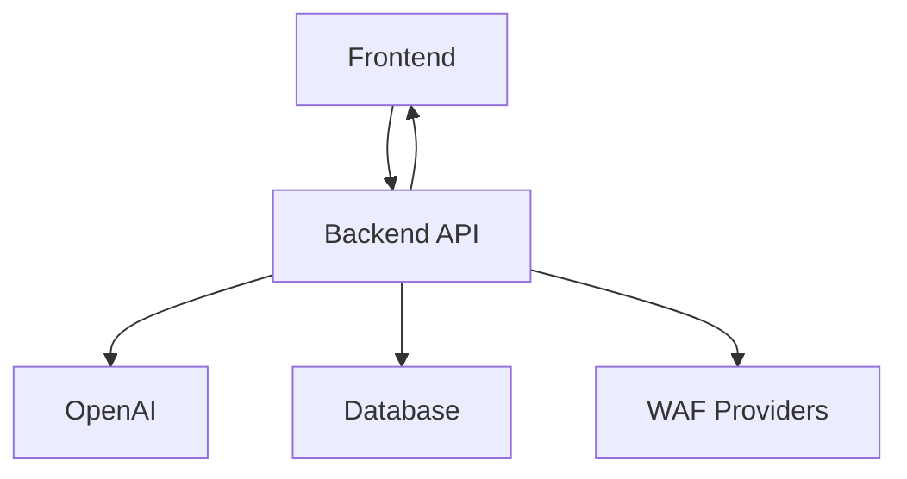
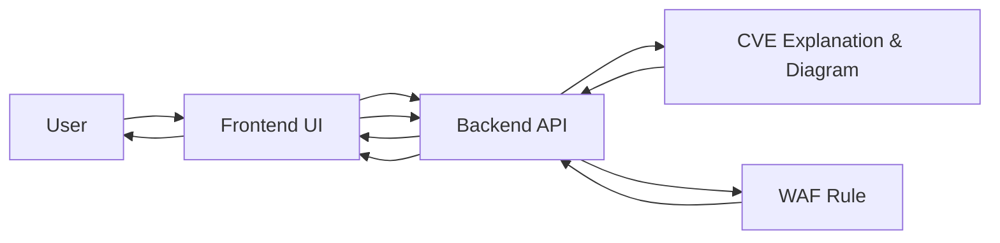

# WAF Copilot

AI-powered assistant for security teams and developers: Instantly understand CVEs and generate deployable WAF rules for AWS, Azure, GCP, and Cloudflare.

---

## Table of Contents

- [Features](#features)
- [How It Works](#how-it-works)
- [Architecture Flowchart](#architecture-flowchart)
- [User Flow](#user-flow)
- [Quick Start](#quick-start)
- [Tech Stack](#tech-stack)
- [Contribution](#contribution)
- [License](#license)

---

## Features

| Feature                | Description                                                                                       |
|------------------------|---------------------------------------------------------------------------------------------------|
| AI-Powered Analysis | Get instant, expert-level explanations for vulnerabilities with clear visual diagrams.            |
| WAF Rule Generation | Generate valid WAF rules for AWS, Azure, GCP, and Cloudflare (in JSON or cURL format).            |
| Multi-Platform      | Supports AWS WAF, Azure Front Door, GCP Cloud Armor, and Cloudflare.                              |
| Visual Flowcharts   | Mermaid.js diagrams illustrate vulnerability impact and mitigation.                               |
| Real-Time Defense   | Create and deploy security rules on demand to defend against emerging threats.                    |

---

## How It Works

1. **Find a CVE**: Search or select a vulnerability.
2. **Understand Instantly**: Get an AI-generated, plain-English explanation and visual diagram.
3. **Protect Fast**: Generate and copy a ready-to-deploy WAF rule for your preferred cloud provider.

---
## Architecture Flowchart



<!-- 
Legend:
A: Frontend (Next.js/React)
B: Backend API (Django/DRF)
C: OpenAI (LLM)
D: Database (SQLite)
E: WAF Providers (AWS, Azure, GCP, Cloudflare)
-->
```

---

## User Flow



---

## Quick Start

```bash
# Clone the repo
git clone https://github.com/CyberUltron-Nikhil/WAF-Copilot.git

# Backend setup
cd backend
python -m venv venv
source venv/bin/activate
pip install -r requirements.txt
python manage.py migrate
python manage.py runserver

# Frontend setup (in new terminal)
cd frontend
npm install
npm run dev
```

---

## Tech Stack

- **Frontend:** Next.js, React (TypeScript)
- **Backend:** Django REST Framework, Python, OpenAI LLMs
- **Database:** SQLite

---

## Contribution

We welcome PRs and feedback!  
Open an issue or submit a pull request to improve WAF Copilot.

---

## License

MIT License

---

> _WAF Copilot – Your AI-powered shield for modern web application security._
